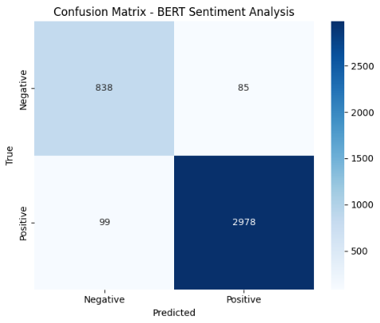

# 🤖 Sentiment Analysis with BERT (Hugging Face Transformers)

A state-of-the-art sentiment classifier fine-tuned using `bert-base-uncased` on Amazon product reviews.  
This project replaces traditional ML methods (TF-IDF + Logistic Regression) with a Transformer-based model for **enhanced performance** and **portfolio impact**.

---

## 📁 Dataset

- **Source**: Amazon product review dataset  
- **Shape**: 20,000 samples  
- **Columns**:
  - `reviewText` — customer-written product reviews  
  - `Positive` — binary sentiment label (`1 = positive`, `0 = negative`)

---

## 🔧 Model Architecture

- **Model**: BERT (`bert-base-uncased`)  
- **Framework**: Hugging Face Transformers  
- **Tokenization**: Max length 128, with truncation and padding  

**Training Configuration**:
- Epochs: **3**
- Batch size: **16**
- Optimizer: **AdamW** with learning rate `2e-5`
- Device: **Colab GPU**
- Monitoring: **Weights & Biases (W&B)** *(optional)*

---

## 📊 Performance Summary

| Epoch | Accuracy | F1 Score | Precision | Recall | Val Loss |
|-------|----------|----------|-----------|--------|----------|
| 1     | 95.45%   | 0.970    | 0.969     | 0.971  | 0.1603   |
| 2     | 95.70%   | 0.972    | 0.972     | 0.972  | 0.1888   |
| 3     | 95.40%   | 0.970    | 0.972     | 0.967  | 0.2258   |

- ✅ **Final Accuracy**: **95.7%**
- ✅ **Final Training Loss**: **0.103**
- ✅ **F1-Score**: **0.972**

---

## 🆚 Accuracy Comparison (Baseline vs BERT)

| Model                        | Accuracy | F1 Score |
|-----------------------------|----------|----------|
| TF-IDF + Logistic Regression| 85.2%    | 84.7%    |
| BERT (Fine-Tuned)           | 95.7%    | 97.2%    |

🎯 **+10.5% Accuracy Boost using Transformers!**

---

## 🧠 Misclassification Insights

### Confusion Matrix

### Sarcasm Detection is Tough:
> *“Yeah, perfect. Just what I wanted — more popups 🙄”*  
> **Predicted**: Positive  
> **Actual**: Negative

### Context-loss in Short Reviews:
> *“Nice.”*  
> Too short and ambiguous to infer clear sentiment

---

## 📌 Summary

- ✅ **Transformer models** like BERT offer significant gains over traditional ML approaches  
- 🔍 Still, nuanced contexts like **sarcasm** or **very short reviews** remain a challenge  
- 📈 Ideal for portfolio projects showcasing **real-world NLP applications**

---

## 📁 Project Structure

📦 sentiment-bert
 ┣ 📜 amazon.csv
 ┣ 📜 sentiment_analysis.ipynb
 ┣ 📜 README.md
 ┣ 📂 images
 ┃ ┗ 📷 confusion_matrix.png

## 🚀 Deployment Plan

### ✅ Option 1: Streamlit App
- Build an interactive UI  
- User types a review and receives:
  - **Sentiment prediction**
  - **Confidence score**

---

### ✅ Option 2: Hugging Face Spaces
- Use **Gradio** or **Streamlit** for interface  
- Easy-to-deploy, cloud-hosted model  
- **No backend/server required** — fully managed by Hugging Face

## Future Plan 
- train my model to act and give answer perfectly on multilingual reviews also 
